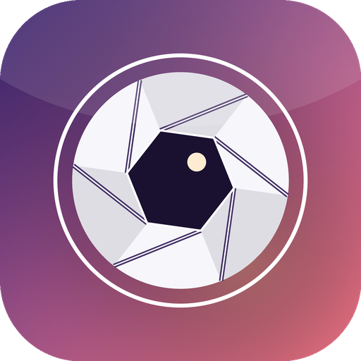

# Momento 📸

**One photo, every day.** A slick, beautiful daily photo journal for iOS — with an
expert-level **timelapse / movie exporter** that stitches your days into a cinematic clip.

Built in **SwiftUI**, native, no third‑party dependencies. Version **0.2**.

<p align="center">
  
</p>

---

## ✨ Features

- **Animated splash screen** — the camera iris opens and the wordmark rises.
- **Interactive animated onboarding** — 4 swipeable pages with self‑animating
  vector illustrations (floating memory cards, a pulsing capture button, a
  calendar that lights up, a film strip resolving into a play button).
- **Today tab** — greeting, live **streak** + moment count, a big capture card
  (empty‑state prompt or today's photo), and an **"On this day"** memory rail.
- **Capture flow** — take a photo (camera) or pick from the library, add a
  **caption** and a **mood**, save. One entry per day (re‑capturing updates it).
- **Memories tab** — browse everything as a **photo grid** or an interactive
  **calendar** where each day shows its photo. Tap to open a full, swipeable detail
  view (edit / share / delete).
- **🎬 Movie / Timelapse export (the expert feature)** — choose a time range
  (7 days / 30 days / this year / all time), a **pace** (Cinematic / Standard /
  Timelapse), **format** (Portrait / Square), and overlays (**crossfades**,
  **dates**, **captions**). Renders a real **H.264 .mp4** with `AVAssetWriter`,
  shows a live progress ring, then lets you **preview**, **save to Photos**, and
  **share**.
- **Daily reminder** — optional local notification so you never break your streak.
- Custom floating tab bar with a raised capture button, haptics throughout, a
  cohesive dark "sunset" theme, and an **AI‑generated app icon**.

## 🏃 Run it (on a Mac)

> The iOS Simulator only runs on macOS, so building/launching happens on your Mac mini.

```bash
cd Momento-iOS
open Momento.xcodeproj
# In Xcode: pick an iPhone simulator (e.g. iPhone 16 Pro) and press ⌘R
```

Or from the command line:

```bash
cd Momento-iOS
xcodebuild -project Momento.xcodeproj -scheme Momento \
  -destination 'platform=iOS Simulator,name=iPhone 16 Pro' build

xcrun simctl boot "iPhone 16 Pro"
open -a Simulator
# then install/launch the built .app, or just use ⌘R from Xcode
```

**Requirements:** Xcode 16+ (the project uses file‑system‑synchronized groups),
iOS 17+ deployment target.

> Tip: the Simulator has no camera. Use **Library** to add a photo, or open
> **Settings → Load sample memories** (Debug builds) to instantly populate a week
> of demo days and try the movie export.

## 🧱 Architecture

```
Momento/
├─ MomentoApp.swift            # App entry, splash → main phase
├─ Models/
│  ├─ JournalEntry.swift       # Codable day entry + Mood
│  └─ JournalStore.swift       # ObservableObject: JSON metadata + on-disk photos, streaks
├─ Theme/
│  ├─ Theme.swift              # Colors, gradients, card style, ambient background
│  ├─ Haptics.swift            # Feedback wrappers
│  └─ Extensions.swift         # Date / UIImage helpers, press animation
├─ Views/
│  ├─ Splash/                  # Animated launch
│  ├─ Onboarding/              # Paged onboarding + illustrations
│  ├─ Root/                    # Floating tab bar + routing
│  ├─ Home/                    # Today tab
│  ├─ Capture/                 # Camera bridge + compose screen
│  ├─ Timeline/                # Grid + calendar
│  ├─ Detail/                  # Swipeable full-screen entry
│  ├─ Export/                  # MovieExporter (AVFoundation) + export UI
│  ├─ Settings/                # Reminders, stats, about
│  └─ Components/              # ApertureMark brand logo
└─ Assets.xcassets/           # AI-generated AppIcon + accent color
```

Photos are stored as JPEGs in the app's Documents directory; entry metadata lives
in `entries.json`. Everything is local and private — no network, no accounts.

## 🎨 App icon

The icon is generated programmatically (a camera iris on a sunset gradient) by
`scripts/generate_icons.py` (Pillow). Re‑run it to regenerate `AppIcon-1024.png`:

```bash
python3 scripts/generate_icons.py
```
